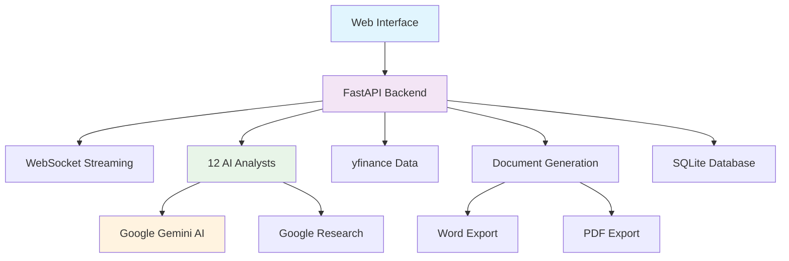
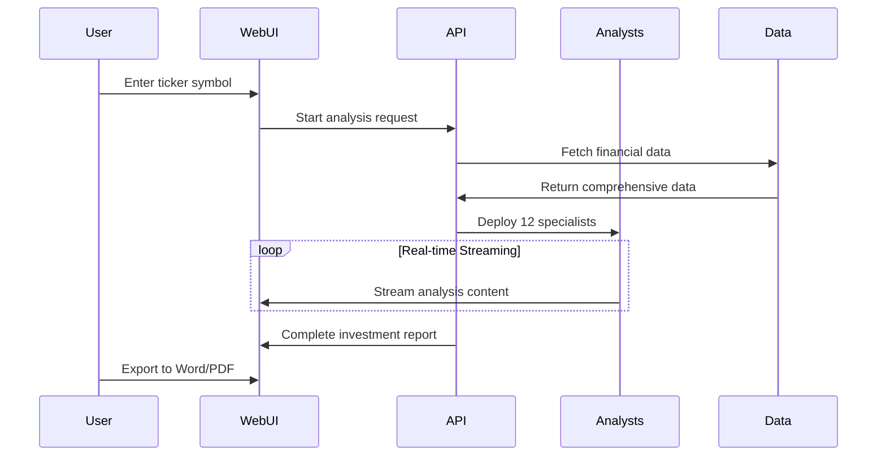

# Robeco AI Investment Analysis System

> **Enterprise-Grade AI-Powered Investment Research Platform**

[](https://www.python.org/downloads/)
[](https://fastapi.tiangolo.com/)
[](https://nodejs.org/)
[]()

## 🏢 Overview

The **Robeco AI Investment Analysis System** is a sophisticated, institutional-grade platform that delivers **hedge fund-quality investment research** through cutting-edge AI technology. Built for professional investors, analysts, and portfolio managers, this system combines **real-time AI analysis**, **comprehensive financial data integration**, and **professional document generation** to streamline the investment research workflow.

### ✨ Key Features

- 🤖 **12 Specialist AI Analysts** - Expert analysis across all investment domains
- ⚡ **Real-Time Streaming** - Token-by-token analysis delivery via WebSocket
- 📊 **Comprehensive Financial Data** - yfinance integration with 30+ data points
- 🔍 **Google Research Integration** - Live web research with credibility scoring
- 📄 **Professional Document Export** - Word & PDF generation with exact formatting
- 🔐 **Enterprise Security** - 115+ API key management with automatic failover
- 📈 **Advanced Charting** - SVG-to-image conversion for reports
- 🎯 **Investment-Grade Output** - Institutional-quality research reports

## 🏗️ System Architecture



### 🎯 12 Specialist AI Analysts

| Analyst | Expertise | Key Focus Areas |
|---------|-----------|-----------------|
| **Chief Investment Officer** | Strategic Leadership | Portfolio strategy, investment thesis, executive insights |
| **Fundamental Analyst** | Financial Health | DCF modeling, earnings quality, balance sheet analysis |
| **Industry Analyst** | Sector Dynamics | Competitive positioning, market trends, industry outlook |
| **Technical Analyst** | Price Action | Chart patterns, momentum indicators, trading signals |
| **Risk Management Analyst** | Risk Assessment | VaR analysis, scenario modeling, downside protection |
| **ESG Analyst** | Sustainability | Environmental impact, governance, social responsibility |
| **Research Analyst** | Market Research | Data analysis, market intelligence, trend identification |
| **Sentiment Analyst** | Market Psychology | Investor sentiment, behavioral analysis, market mood |
| **Management Analyst** | Corporate Governance | Leadership quality, strategic vision, execution capability |
| **Business Model Analyst** | Revenue Strategy | Business model analysis, competitive advantages |
| **Valuation Analyst** | Asset Pricing | Valuation models, relative comparisons, fair value |
| **Macro Economist** | Economic Context | Economic trends, monetary policy, market conditions |

## 🚀 Quick Start

### Prerequisites

- **Python 3.8+** (recommended: 3.11+)
- **Node.js 16.0+** (recommended: 18.0+)
- **4GB RAM** minimum (8GB recommended)
- **Stable internet connection**
- **Google Gemini API keys**

### Installation

1. **Clone the Repository**
   ```bash
   git clone <repository-url>
   cd "Robeco Reporting"
   ```

2. **Set Up Python Environment**
   ```bash
   python -m venv venv
   source venv/bin/activate  # On Windows: venv\Scripts\activate
   pip install -r requirements.txt
   ```

3. **Install Node.js Dependencies**
   ```bash
   npm install
   npx puppeteer browsers install chrome
   ```

4. **Configure API Keys**
   ```bash
   # Create API key files
   echo "your_primary_gemini_key" > src/robeco/backend/api_key/primary_gemini_key.txt
   echo -e "backup_key_1\nbackup_key_2\n..." > src/robeco/backend/api_key/gemini_api_keys.txt
   ```

5. **Launch the System**
   ```bash
   # Production launch (recommended)
   python run_professional_system.py
   
   # Alternative development launch
   python src/robeco/backend/professional_streaming_server.py
   ```

6. **Access the Platform**
   - **Local Access**: `http://127.0.0.1:8005` (or auto-assigned port)
   - **Network Access**: `http://172.20.10.2:8005` (from other devices)
   - Professional workbench available immediately

## 📋 Usage Guide

### 1. Investment Analysis Workflow



### 2. Basic Analysis Process

1. **Navigate to Professional Workbench** - Access via browser at configured URL
2. **Enter Company Details** - Ticker symbol (e.g., "AAPL") and company name
3. **Select Analysis Scope** - Choose specific analysts or full team deployment
4. **Watch Real-time Analysis** - Streaming content as AI generates insights
5. **Export Professional Report** - Word or PDF format with institutional styling

### 3. Advanced Features

#### Real-Time Streaming Analysis
- **Token-by-Token Delivery** - See analysis as it's generated
- **Progress Indicators** - Track completion across all analysts
- **Research Integration** - Live web research with source citations
- **Interactive Interface** - Pause, resume, or modify analysis scope

#### Professional Report Generation
- **Template-Based Reports** - Robeco Investment Case Template integration
- **Multi-Slide Presentation** - Cover slide, executive summary, detailed analysis
- **Cross-Agent Synthesis** - All analyst outputs combined into cohesive report
- **Professional Formatting** - Institutional-grade styling and branding

#### Document Export Capabilities
- **Professional Word Reports** - Exact HTML-to-Word conversion with charts
- **High-Quality PDF Export** - Custom A4 format (1620x2291px) for presentations
- **Chart Integration** - SVG charts automatically converted to embedded images
- **Branded Templates** - Robeco professional styling and layouts

## 🛠️ Technical Specifications

### Backend Architecture
```
src/robeco/backend/
├── ultra_sophisticated_multi_agent_engine.py  # Core AI orchestration
├── professional_streaming_server.py           # FastAPI main server
├── professional_api.py                       # API endpoint handlers
├── template_report_generator.py              # Professional report engine
├── word_report_generator.py                  # Word document conversion
├── enhanced_pdf_service.py                   # PDF generation service
├── bulk_file_processor.py                    # File processing system
├── websocket_manager.py                      # WebSocket communication
└── api_key/
    ├── primary_gemini_key.txt                # Primary API key
    ├── gemini_api_keys.txt                   # 115+ backup key pool
    └── gemini_api_key.py                     # Intelligent key management
```

### Core Technology Stack
- **FastAPI** - Modern async web framework with WebSocket support
- **Google Gemini AI** - Advanced language model with 115+ key rotation
- **yfinance** - Comprehensive real-time financial data integration
- **BeautifulSoup4** - HTML parsing for document processing
- **python-docx** - Professional Word document generation
- **Puppeteer** - PDF generation and SVG-to-image conversion
- **SQLAlchemy** - Database ORM with SQLite/PostgreSQL support

### Frontend Components
```
src/robeco/frontend/
├── templates/
│   ├── robeco_professional_workbench_enhanced.html  # Main interface
│   └── robeco_investment_workbench_mvp.html         # Alternative UI
└── static/
    ├── css/
    │   └── professional_data_components.css         # Professional styling
    └── js/
        ├── professional_data_components.js          # Data visualization
        └── analysis_persistence.js                  # Result caching
```

## 📊 Data Sources & Analysis Coverage

### Financial Data Integration (yfinance)
- **Real-Time Pricing** - Current price, volume, market cap, trading metrics
- **Financial Statements** - Income statement, balance sheet, cash flow (5-year history)
- **Financial Ratios** - 20+ key ratios including P/E, P/B, ROE, debt metrics, margins
- **Analyst Coverage** - Wall Street estimates, recommendations, price targets
- **Technical Indicators** - Moving averages, RSI, MACD, volatility measures
- **Company Fundamentals** - Business description, sector/industry classification
- **Options Data** - Implied volatility, put/call ratios, options flow

### Google Research Integration
- **Real-Time Web Research** - Live search integration during analysis
- **Source Credibility Scoring** - AI-powered reliability assessment (High/Medium/Low)
- **Citation Management** - Automatic [1], [2], [3] citation placement
- **Content Synthesis** - Integration of multiple research sources
- **Grounding Verification** - Google grounding supports for fact validation

### AI Analysis Capabilities
- **Deep Financial Modeling** - DCF analysis, scenario modeling, sensitivity analysis
- **Industry Intelligence** - Competitive landscape, market dynamics, regulatory environment
- **Technical Analysis** - Chart patterns, momentum indicators, support/resistance levels
- **Risk Assessment** - Multi-dimensional risk evaluation, stress testing scenarios
- **ESG Integration** - Sustainability metrics, governance evaluation, social impact
- **Contrarian Analysis** - Market inefficiency identification, consensus error analysis

## 🔧 Configuration & Deployment

### Environment Settings

```python
# Core Server Configuration
class Settings:
    HOST: str = "0.0.0.0"
    PORT: int = 8005  # Auto-increment on conflicts
    DEBUG: bool = True
    
    # AI Configuration
    MAX_CONCURRENT_AGENTS: int = 12
    STREAMING_CHUNK_SIZE: int = 50
    ANALYSIS_TIMEOUT: int = 300
    
    # Document Generation
    PDF_FORMAT: str = "A4_CUSTOM"  # 1620x2291px
    WORD_TEMPLATE: str = "professional"
    
    # Network Access
    ALLOWED_ORIGINS: List[str] = [
        "http://localhost:3000",
        "http://127.0.0.1:8005",
        "http://172.20.10.2:8005"
    ]
```

### API Key Management System

```python
# Intelligent API Key Rotation
class APIKeyManager:
    def __init__(self):
        self.primary_key = self._load_primary_key()    # Highest priority
        self.backup_keys = self._load_backup_keys()    # 115+ backup pool
        self.failed_keys = set()                       # Suspension tracking
        self.usage_stats = defaultdict(int)            # Usage analytics
        
    def get_active_key(self) -> str:
        # Try primary key first
        # Rotate through backup keys on failure
        # Track suspension status
        # Implement exponential backoff
```

### Network Configuration

```python
# Multi-Network Access Support
NETWORK_ENDPOINTS = {
    "local": "http://127.0.0.1:8005",
    "network": "http://172.20.10.2:8005",
    "alternative": "http://10.14.0.2:8005"
}

# Automatic Port Selection
PORT_RANGE = [8005, 8006, 8007, 8008]  # Auto-increment on conflicts
```

## 📈 Performance & Scalability

### Analysis Performance Metrics
- **Single Analyst Analysis** - 30-120 seconds with real-time streaming
- **Multi-Agent Comprehensive Analysis** - 3-8 minutes for full 12-analyst deployment
- **Document Generation** - 10-30 seconds for professional reports
- **Real-Time Streaming Latency** - <200ms token-by-token delivery
- **Google Research Integration** - 5-15 high-quality sources per analysis

### Scalability Features

#### Multi-Key Management
- **115+ API Keys** - Massive concurrent analysis capability
- **Intelligent Load Balancing** - Optimal key distribution across requests
- **Automatic Failover** - Seamless switching on key suspension/rate limits
- **Usage Analytics** - Real-time monitoring of key health and performance
- **Statistical Tracking** - Key performance metrics and failure analysis

#### Memory & Resource Management
```python
# Automatic Resource Cleanup
class ResourceManager:
    def __init__(self):
        self.active_analyses = {}
        self.temp_files = []
        self.websocket_connections = set()
        
    async def cleanup_completed_analysis(self, analysis_id: str):
        # Clear analysis data from memory
        # Remove temporary image files
        # Update performance metrics
        # Log resource usage stats
```

#### Document Processing Performance
- **Word Generation** - High-quality HTML-to-Word conversion with chart embedding
- **PDF Export** - Custom A4 format optimization (1620x2291px)
- **Chart Conversion** - SVG-to-PNG conversion using Puppeteer Chrome engine
- **Template Caching** - Pre-compiled template optimization for speed

## 🔐 Security & Compliance

### Enterprise Security Features

#### Authentication & Access Control
```python
# JWT Token-Based Authentication (Production Ready)
class SecurityManager:
    def __init__(self):
        self.secret_key = os.getenv("JWT_SECRET_KEY")
        self.algorithm = "HS256"
        self.token_expire_minutes = 60
        
    def create_access_token(self, user_data: dict) -> str:
        # Generate secure JWT tokens with expiration
        
    def verify_token(self, token: str) -> dict:
        # Validate and decode JWT tokens
        # Handle token expiration and refresh
```

#### API Key Security
- **Encrypted Storage** - Secure API key encryption at rest
- **Rotation Schedules** - Automated key rotation policies
- **Usage Monitoring** - Comprehensive access and usage tracking
- **Audit Logging** - Complete request/response audit trails
- **Rate Limiting** - DDoS protection with configurable limits per endpoint

#### Data Protection
```python
# Comprehensive Data Sanitization
class DataProtection:
    @staticmethod
    def sanitize_financial_data(data: dict) -> dict:
        # Remove or encrypt sensitive information
        # Implement data retention policies
        # GDPR compliance measures
        
    @staticmethod
    def audit_log_access(user_id: str, resource: str, action: str):
        # Log all data access for compliance
        # Track user behavior patterns
        # Generate compliance reports
```

### Input Validation & Security
- **Request Sanitization** - Comprehensive input validation and sanitization
- **SQL Injection Prevention** - Parameterized queries and ORM protection
- **XSS Protection** - HTML content sanitization in document generation
- **CORS Security** - Proper cross-origin resource sharing configuration
- **WebSocket Security** - Secure WebSocket connection validation

## 🧪 Testing & Quality Assurance

### Comprehensive Test Suite
```bash
# Run complete test suite
python -m pytest tests/

# Specific test categories
python -m pytest tests/unit/          # Unit tests for core components
python -m pytest tests/integration/   # Integration tests for full workflows  
python -m pytest tests/api/          # API endpoint validation tests
python -m pytest tests/websocket/    # WebSocket communication tests
python -m pytest tests/document/     # Document generation tests
```

### Quality Control
```
Testing files/
├── test_citation_debug.py          # Citation system validation
├── test_websocket_debug.py         # WebSocket communication testing
├── test_yfinance_*.py              # Financial data integration tests
├── test_word_generation.py         # Word document generation tests
├── test_pdf_conversion.py          # PDF export functionality tests
└── test_full_integration.py        # Complete system integration tests
```

### Code Quality Standards
- **Type Checking** - mypy static analysis with comprehensive type hints
- **Code Linting** - flake8, black formatting for consistent code style
- **Security Scanning** - Automated vulnerability assessment and dependency checking
- **Performance Profiling** - Memory usage monitoring and CPU performance analysis

## 📚 Professional Use Cases

### Investment Professionals
- **Equity Research** - Comprehensive stock analysis across all investment dimensions
- **Portfolio Management** - Investment thesis development and validation with risk assessment
- **Due Diligence** - Deep-dive company and industry analysis with competitive intelligence
- **Client Reporting** - Professional-grade investment reports with institutional branding

### Financial Institutions
- **Research Automation** - Scalable analysis across large portfolios and watch lists
- **Risk Management** - Multi-dimensional risk evaluation and stress testing frameworks
- **Regulatory Compliance** - Compliant documentation generation for regulatory submissions
- **Analyst Training** - AI-assisted analyst development and best practice standardization

### Independent Analysts & Consultants
- **Freelance Research** - Professional-quality analysis capabilities without infrastructure costs
- **Consulting Services** - Branded report generation for client deliverables
- **Educational Content** - Teaching materials and case study development
- **Personal Investment** - Advanced analysis tools for personal portfolio management

## 🔄 Recent Enhancements & Bug Fixes

### Version 2.0.0 (Latest Release)
- ✅ **Enhanced Word Document Generation** - Perfect HTML-to-Word conversion with chart integration
- ✅ **SVG Chart Processing** - Automated SVG-to-PNG conversion for embedded reports
- ✅ **Puppeteer PDF Engine** - Professional PDF generation with custom A4 formatting
- ✅ **Chrome Browser Auto-Installation** - Streamlined setup with automatic browser detection
- ✅ **115+ API Key Infrastructure** - Massive scaling capability with intelligent rotation
- ✅ **Real-Time Google Research** - Live web research integration with citation management
- ✅ **Professional Template System** - Robeco Investment Case Template integration

### Critical Bug Fixes
- 🔧 **Fixed Chrome Browser Detection** - Resolved Puppeteer Chrome installation issues
- 🔧 **SVG-to-Image Conversion** - Enhanced chart processing in Word document generation
- 🔧 **API Key Rotation Reliability** - Improved failover mechanisms and error handling
- 🔧 **WebSocket Connection Stability** - Enhanced connection management and recovery
- 🔧 **Memory Optimization** - Improved resource cleanup and garbage collection
- 🔧 **Document Template Processing** - Fixed CSS integration and layout preservation

## 📞 Support & Maintenance

### Production Deployment Options

#### Option 1: Standard Python Launch
```bash
# Production launch with all features
python run_professional_system.py
```

#### Option 2: Gunicorn Production Server
```bash
# Install production ASGI server
pip install gunicorn

# Launch with multiple workers
gunicorn -w 4 -k uvicorn.workers.UvicornWorker \
  --bind 0.0.0.0:8005 \
  --timeout 300 \
  --worker-class uvicorn.workers.UvicornWorker \
  src.robeco.backend.main:app
```

#### Option 3: Docker Containerization
```dockerfile
FROM python:3.11-slim

# Install system dependencies
RUN apt-get update && apt-get install -y \
    curl \
    nodejs \
    npm \
    && rm -rf /var/lib/apt/lists/*

WORKDIR /app
COPY requirements.txt package.json ./
RUN pip install -r requirements.txt && npm install

# Install Puppeteer Chrome browser
RUN npx puppeteer browsers install chrome

COPY . .
EXPOSE 8005
CMD ["python", "run_professional_system.py"]
```

### Health Monitoring & Diagnostics

#### System Health Endpoints
```bash
# Basic health check
curl http://127.0.0.1:8005/health

# Detailed system status
curl http://127.0.0.1:8005/api/status

# API key status monitoring
curl http://127.0.0.1:8005/api/keys/status
```

#### Performance Monitoring
```python
# Built-in performance tracking
@app.middleware("http")
async def performance_middleware(request: Request, call_next):
    start_time = time.time()
    response = await call_next(request)
    process_time = time.time() - start_time
    
    # Log request performance
    logger.info(f"Request {request.url} completed in {process_time:.2f}s")
    response.headers["X-Process-Time"] = str(process_time)
    return response
```

### Troubleshooting Guide

#### Common Issues & Solutions

**Port Conflicts**
```bash
# System automatically tries ports 8005, 8006, 8007, etc.
# Check startup logs for actual assigned port
tail -f logs/server.log | grep "Server running"
```

**API Key Configuration**
```bash
# Verify primary key
cat src/robeco/backend/api_key/primary_gemini_key.txt

# Check backup key pool
wc -l src/robeco/backend/api_key/gemini_api_keys.txt
# Should show 115+ lines
```

**WebSocket Connection Issues**
```bash
# Test WebSocket connectivity
curl -i -N \
  -H "Connection: Upgrade" \
  -H "Upgrade: websocket" \
  -H "Sec-WebSocket-Key: test" \
  -H "Sec-WebSocket-Version: 13" \
  http://127.0.0.1:8005/ws/professional
```

**Document Generation Problems**
```bash
# Verify Puppeteer Chrome installation
npx puppeteer browsers install chrome

# Check Chrome browser availability
ls -la .cache/puppeteer/chrome/
```

## 📋 Roadmap & Future Development

### Near-Term Enhancements (Q2 2024)
- 🔄 **Multi-Language Support** - Localized analysis and reporting in multiple languages
- 📊 **Enhanced Visualization** - Advanced charting and interactive data presentation
- 🔗 **Enterprise Data Connectors** - Bloomberg Terminal, Refinitiv Eikon integration
- 🤖 **Custom Analyst Training** - User-defined specialist analyst configurations
- 📱 **API Client Libraries** - Python, JavaScript, and R client libraries

### Long-Term Vision (2024-2025)
- 🌐 **Cloud-Native Deployment** - AWS/Azure/GCP enterprise hosting solutions
- 📱 **Mobile Applications** - Native iOS and Android interfaces with offline capabilities
- 🔮 **Predictive Analytics** - Machine learning-based forecasting and trend prediction
- 🤝 **Collaboration Features** - Team-based analysis sharing and collaborative workflows
- 🏛️ **Institutional Integration** - Portfolio management system integrations and APIs

### Enterprise Features Pipeline
- **Single Sign-On (SSO)** - SAML/OAuth integration for enterprise authentication
- **Role-Based Access Control** - Granular permission management and user roles
- **Audit & Compliance** - Enhanced logging and regulatory compliance features
- **Multi-Tenant Architecture** - Support for multiple organizations and data isolation
- **Advanced Analytics** - Performance attribution, risk analytics, and portfolio optimization

---

## 📄 License & Legal

This software is proprietary and confidential. All rights reserved. Unauthorized copying, distribution, or modification is strictly prohibited.

**© 2024 Robeco AI Investment Analysis System. All Rights Reserved.**

For enterprise licensing, custom development, or partnership opportunities, please contact the development team.

---

## 🤝 Contributing & Development

### Development Environment Setup
```bash
# Clone repository
git clone <repository-url>
cd "Robeco Reporting"

# Create development environment
python -m venv dev_env
source dev_env/bin/activate  # Windows: dev_env\Scripts\activate

# Install development dependencies
pip install -r requirements.txt
pip install -r dev-requirements.txt  # Additional dev tools

# Install pre-commit hooks
pre-commit install

# Run in development mode
python run_professional_system.py --debug
```

### Code Contribution Guidelines
- **Code Style** - Follow PEP 8 standards with black formatting
- **Type Hints** - All functions must include comprehensive type hints
- **Documentation** - Docstrings required for all public methods
- **Testing** - New features must include comprehensive unit tests
- **Security** - All user inputs must be validated and sanitized

### Architecture Extension Points
- **Custom Analysts** - Add new specialist analyst types in `institutional_analyst_prompts.py`
- **Data Sources** - Extend financial data integration in `yfinance_fetcher.py`
- **Document Templates** - Create new report templates in `Report Example/`
- **API Endpoints** - Add new endpoints in `professional_api.py`
- **Frontend Components** - Extend UI in `frontend/templates/`

---

**Built with ❤️ for Professional Investors Worldwide**

*Transforming investment research through AI-powered intelligence and institutional-grade analysis capabilities.*